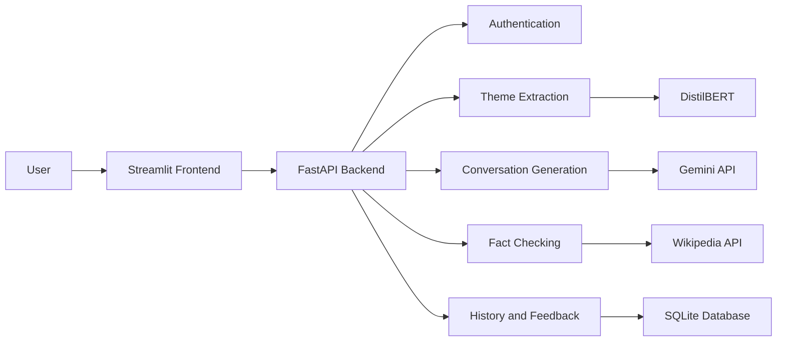

# Data Flow Diagram

```mermaid
flowchart LR
    U[User] --> F[Streamlit Frontend]
    F --> B[FastAPI Backend]
    B --> A[Authentication]
    B --> T[Theme Extraction]
    B --> G[Conversation Generation]
    B --> C[Fact Checking]
    B --> H[History and Feedback]
    T --> M[DistilBERT]
    G --> N[Gemini API]
    C --> W[Wikipedia API]
    H --> S[SQLite Database]
```

