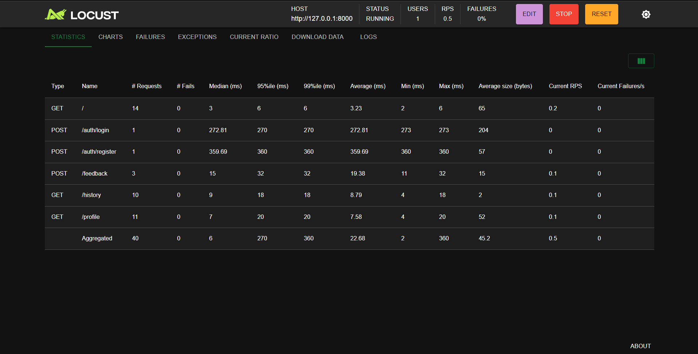
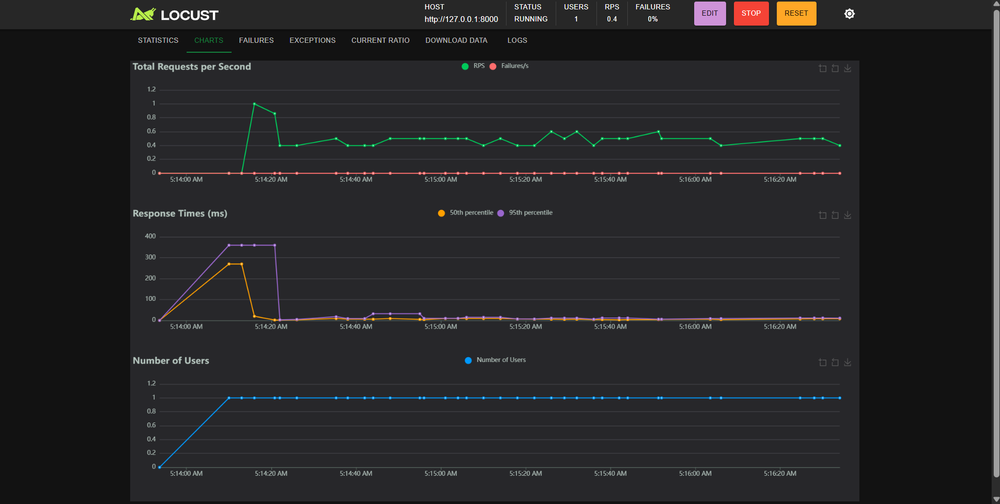

# Performance Testing

**Date:** 7 July 2026  
**Team ID:**  
**Project Name:** Personal Network Assistant  
**Maximum Marks:** 5 Marks

## 1. Testing Overview

| Field | Details |
|---|---|
| Testing Tool Used | Locust |
| Type of Testing | Load Testing |
| Target Module / API | Personal Network Assistant REST API |
| Test Environment | Local development environment, FastAPI at http://127.0.0.1:8000 |
| Test Date | 7 July 2026 |

The captured Locust evidence shows a local load test running against the REST API at `http://127.0.0.1:8000`. The visible statistics screen shows 1 active virtual user, 40 total requests, 0 failures, and 0% failure rate.

The saved HTML and CSV report files currently present under `reports/` show a separate failed run against `http://127.0.0.1:8001`, with connection-refused errors. Because those report files do not match the provided screenshots' host, endpoint set, request counts, or later screenshot timestamps, the screenshots are treated as the completed run evidence for this document.

## 2. Test Scenarios

| Scenario | Endpoint(s) Exercised | Method | Virtual Users | Duration |
|---|---|---|---:|---|
| Health check | `/` | GET | 1 | Not visible in screenshot |
| Registration and login | `/auth/register`, `/auth/login` | POST | 1 | Not visible in screenshot |
| Profile retrieval | `/profile` | GET | 1 | Not visible in screenshot |
| History retrieval | `/history` | GET | 1 | Not visible in screenshot |
| Feedback submission | `/feedback` | POST | 1 | Not visible in screenshot |

The documented headless command for this test uses a 60-second duration, but the supplied screenshots show an interactive Locust run in progress and do not display a completed elapsed duration.

## 3. Performance Test Results

| Metric | Target | Actual Result | Status |
|---|---:|---:|---|
| Response Time (Avg) | < 2 seconds | 22.68 ms | Pass |
| Response Time (Max) | < 5 seconds | 360 ms | Pass |
| Throughput (Req/sec) | No predefined target | 0.5 current RPS shown | Not evaluated |
| Error Rate | < 1% | 0% (0 failures / 40 requests) | Pass |
| CPU Utilization | < 80% | Not measured | Not evaluated |
| Memory Utilization | < 80% | Not measured | Not evaluated |

### Endpoint-Level Results

| Type | Endpoint | Requests | Failures | Median (ms) | 95th Percentile (ms) | 99th Percentile (ms) | Average (ms) | Min (ms) | Max (ms) | Current RPS |
|---|---|---:|---:|---:|---:|---:|---:|---:|---:|---:|
| GET | `/` | 14 | 0 | 3 | 6 | 6 | 3.23 | 2 | 6 | 0.2 |
| POST | `/auth/login` | 1 | 0 | 272.81 | 270 | 270 | 272.81 | 273 | 273 | 0 |
| POST | `/auth/register` | 1 | 0 | 359.69 | 360 | 360 | 359.69 | 360 | 360 | 0 |
| POST | `/feedback` | 3 | 0 | 15 | 32 | 32 | 19.38 | 11 | 32 | 0.1 |
| GET | `/history` | 10 | 0 | 9 | 18 | 18 | 8.79 | 4 | 18 | 0.1 |
| GET | `/profile` | 11 | 0 | 7 | 20 | 20 | 7.58 | 4 | 20 | 0.1 |
| Aggregated | All endpoints | 40 | 0 | 6 | 270 | 360 | 22.68 | 2 | 360 | 0.5 |

## 4. Observations & Analysis

### Key Findings

- Reliability was strong in the completed screenshot evidence: 40 requests completed with 0 failures, giving a calculated error rate of 0%.
- Aggregate latency was within the stated target, with an average response time of 22.68 ms and a maximum response time of 360 ms.
- The displayed throughput is current RPS, not average throughput. The statistics screenshot shows 0.5 current RPS, while the charts screenshot shows 0.4 RPS at the moment captured.
- The health, profile, history, and feedback endpoints responded quickly, with average response times below 20 ms.

### Bottlenecks Identified

- The slowest measured endpoint was `/auth/register`, with an average response time of 359.69 ms and a maximum response time of 360 ms.
- The next slowest measured endpoint was `/auth/login`, with an average response time of 272.81 ms and a maximum response time of 273 ms.
- No proven bottleneck was observed for `/`, `/profile`, `/history`, or `/feedback` in the completed screenshot evidence.
- The separate saved report files show connection-refused failures against a different host and port, which indicates the backend was not reachable for that run. This is a setup failure for that report, not evidence of an application endpoint bottleneck.

### Optimization Steps Taken

- No optimization was applied during this documented run.
- Recommended next steps include reviewing database queries for authenticated endpoints, reusing connections where appropriate, adding caching for read-heavy deterministic responses, configuring clear request timeouts, and separating deterministic API endpoints from external-service-dependent tests.

## 5. Screenshots / Evidence

Locust statistics view showing 1 active user, 40 total requests, 0 failures, aggregate average response time of 22.68 ms, and 0.5 current RPS.

Locust charts view showing request rate, response time percentiles, and 1 active virtual user during the captured run.
